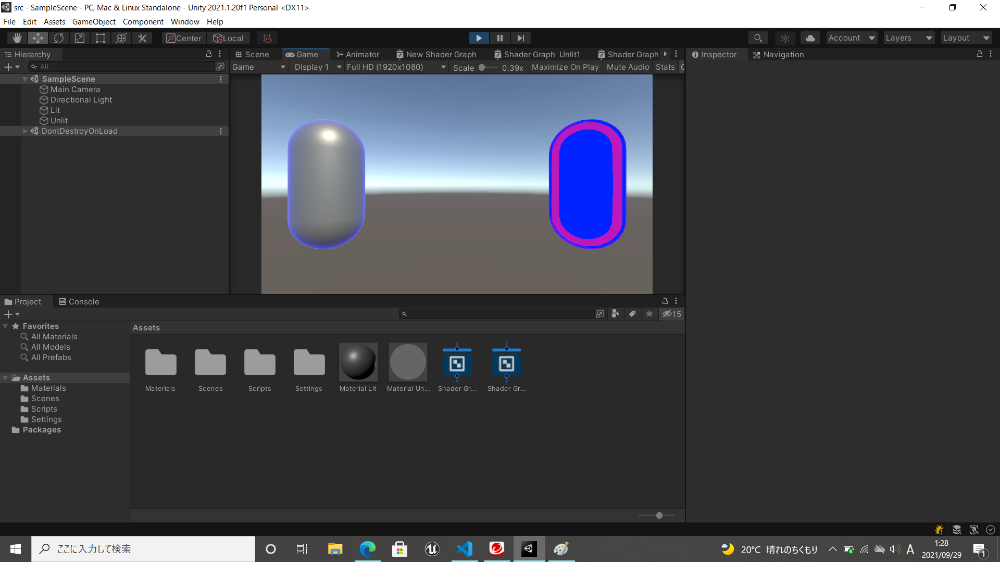
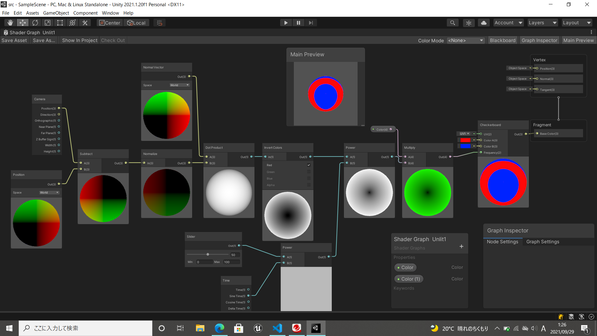

# オブジェクトのシェーダ
物体に適応するシェーダを変更します。
オブジェクトの入力データである法線ベクトルを使った効果を実装します。

# 自分なりに変更した点

-Timeノード使って動きをつけた
-CheackBoardで複雑にするにした
-

# 進め方

- 本リポジトリをフォークしてください
- フォークしたリポジトリをcloneします
- Unityのプロジェクトを更新して実装してください。
  - リムライトを実装してください
  - [ノード一覧](https://docs.unity3d.com/ja/Packages/com.unity.shadergraph@10.0/manual/Node-Library.html)を10分以上見て、自分なりにロジックを変更しよう
    - 案1: リムライトの色を時間で変える
    - 案2: リムライトの色を場所に応じて変える
    - 案3: 光源の情報を使ったライティングを行う
- このテキストファイルに変更点を記載してください
- result.pngを自分の結果を保存して差し替えてください
- node_graph.pngを自分のシェーダグラフの結果に差し替えてください
- プルリクエストを出して提出してください
